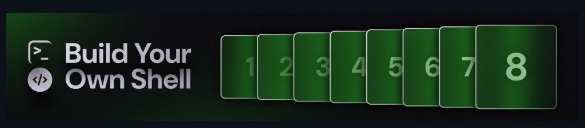

# Shell

A POSIX-ish shell in C from the [CodeCrafters challenge](https://app.codecrafters.io/courses/shell/overview).

It can interpret shell commands, run external programs, and builtins like `cd`, `pwd`, `echo`, `type`, `history`, `jobs`, `declare`, and `complete`. It also does pipes (`|`), redirects (`>`, `>>`), background jobs (`&`), Tab autocomplete, and a REPL with history (↑↓).

**Note**: If you're viewing this repo on GitHub, head over to [codecrafters.io](https://codecrafters.io) to try the challenge.

Run: `./your_program.sh` or `make run`

## Files

| File | Job |
|------|-----|
| `src/main.c` | Start here. Reads keys. Tab / ↑↓. Turns a line into words. Calls the pipeline. |
| `src/pipeline.c` | Splits on `\|`. Handles `>` / `>>` / `&`. Runs builtins or `fork`+`exec`. |
| `src/history.c` | Past commands. Arrow keys + `history` builtin. Optional `HISTFILE`. |
| `src/jobs.c` | Background jobs (`&`). `jobs` builtin. Cleans up finished ones. |
| `src/variables.c` | `declare` / `$name`. Thin wrap over the map. |
| `src/compspec.c` | Custom Tab complete (`complete -C`). |
| `src/trie.c` | Fast prefix search for command names on Tab. |
| `src/map.c` | Simple key → value store. Used by variables + compspec. |
